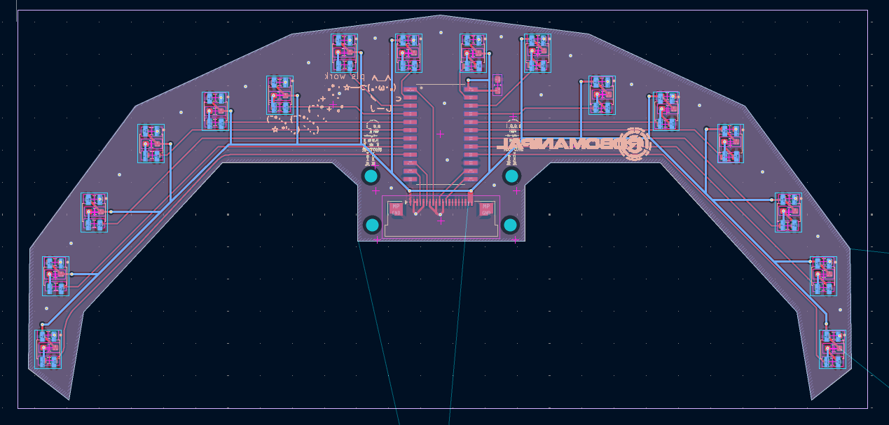
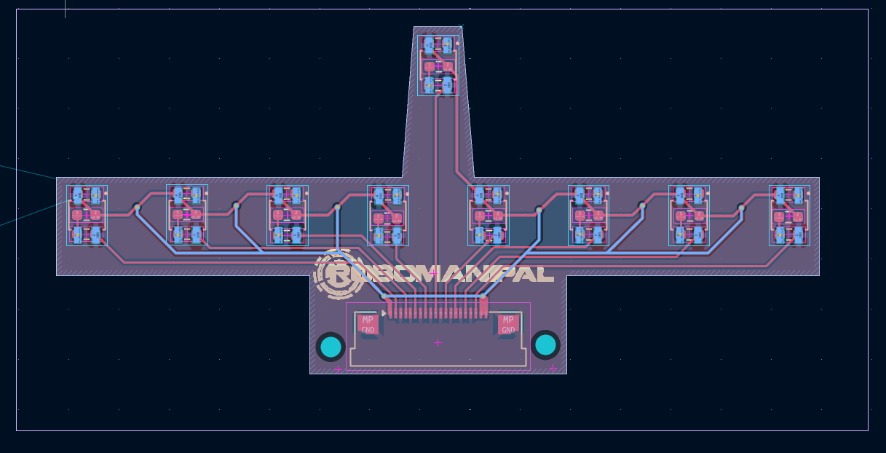
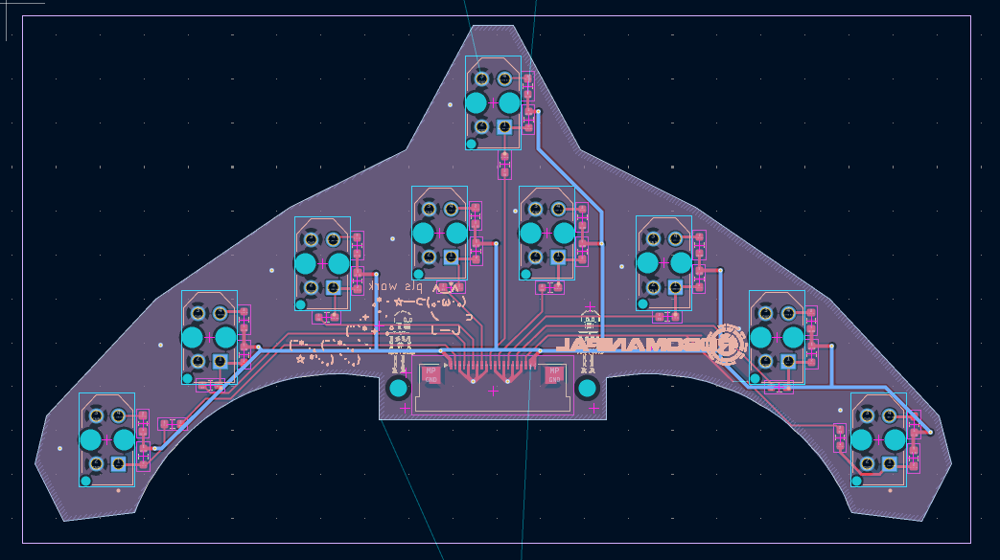
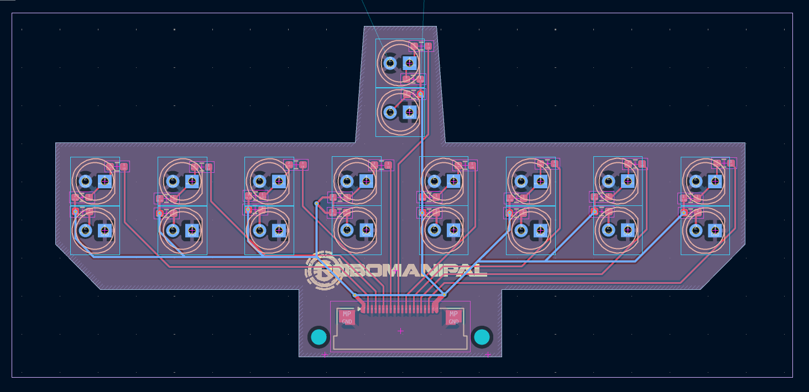
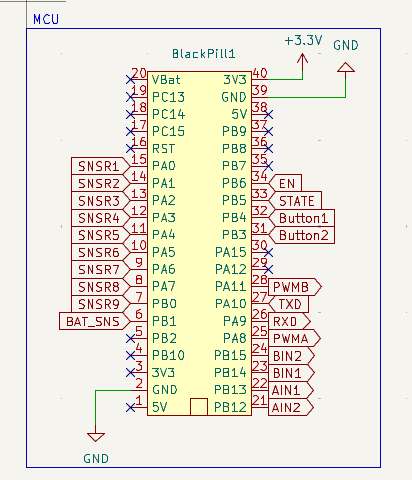

# FLF Bot Modular PCB

A modular PCB platform for Fast Line Follower (FLF) robots, designed to prioritize sensor experimentation and component flexibility.
This board allows multiple sensor array designs to be used interchangeably without redesigning the core electronics.
Instead of committing to a single sensor layout, this PCB supports four distinct sensor array designs, all compatible with the same base system.

---

## Menu

- [Core Features](#core-features)  
- [Core Components](#core-components--design-choices)  
- [Sensor System](#interchangeable-sensor-arrays)  
- [8+1 Sensor Strategy](#81-sensor-placement-strategy)  
- [Main Control PCB](#main-control-pcb)  
- [MCU Control](#mcu-control)  
- [Design Considerations](#design-considerations)  

---

## Core Features

* 4 interchangeable sensor array designs
* Modular architecture using headers
* STM32F411 (Blackpill) based control
* HC-05 Bluetooth connectivity
* Stackable PCB with internal battery space

---

## Core Components & Design Choices

### Microcontroller —  (Blackpill)

* High-speed ADC for sensor reading
* Rich GPIO availability
* Hardware timers for motor PWM
* Plug-in module → easy replacement

---

### Motor Driver — 

* Dual DC motor driver
* Efficient and compact
* Suitable for N20 motors

---

### Voltage Regulation — 

* Buck converter → stable 3.3V
* High efficiency for battery operation
* Adjustable output

---

### Communication — 

* UART-based Bluetooth module
* Used for debugging and tuning
* Supports STATE and EN pins

---

### Analog Multiplexer — 

* 16-channel analog MUX
* Used in high-density sensor configuration
* Reduces MCU pin usage

---

## Sensors

#### 

* Compact reflective IR sensor
* Fast response
* Used in high-density and simple arrays

#### 

* Larger footprint
* More tolerant of alignment and height

#### 

* Discrete design
* Custom Sensors
* Fully tunable sensitivity

---

## Interchangeable Sensor Arrays

All arrays share a common connector interface, making them plug-and-play.

### 1. 16-Sensor Curved Array (QRE1113 + MUX)

* High resolution                            
* Uses 74HC4067
* Designed for aggressive curves

### 2. 9-Sensor Straight Array (QRE1113)

* Direct MCU input
* Low latency
* Simpler processing

### 3. 9-Sensor Curved Array (TCRT5000)

* Better surface tolerance
* Slight curvature improves tracking

### 4. Custom Sensor Array

* IR LED + PT334-6C
* Fully customizable behaviour

---

## 8+1 Sensor Placement Strategy

* 8 main sensors → line tracking
* +1 front sensor → overshoot detection

Improves turning accuracy at high speed.

---

## MCU Control

The STM32F411 (Blackpill) acts as the central controller, interfacing with sensors, motor driver, and Bluetooth module.

* Reads sensor data:

  * Direct ADC (for 9-sensor arrays)
  * Via 74HC4067 MUX (for 16-sensor array)
* Processes line position
* Controls motors using PWM + direction pins (TB6612FNG)
* Handles UART communication with HC-05

All sensor arrays use a consistent interface, so firmware changes are minimal when switching configurations.

---

## Main Control PCB

This section describes the core board that handles control, power distribution, and user interaction.

* Hosts the STM32F411 (Blackpill), TB6612FNG motor driver, and HC-05 module
* Separates logic and motor power to reduce noise interference
* Includes dual switches:
  * Motor Kill
  * Battery Kill

* Provides connectors for all interchangeable sensor arrays
* Routes sensor signals (direct or via MUX) to the MCU
* Includes 2 push buttons:
  * Used for control, mode selection, and calibration
  * Hardware debounced (RC)
* Designed as part of a stacked PCB system:
  * Interfaces with the top board via pin headers
  * Creates space between layers for battery placement

  
  
---

## Design Considerations

- Tradeoff between sensor resolution and sampling speed (MUX vs direct ADC)
- Separation of motor and logic power to reduce noise
- Modular sensor interface to allow rapid hardware iteration
- Use of off-the-shelf modules (MCU, driver, regulator) for reliability and easy replacement
- Support for multiple sensor geometries to evaluate performance under different track conditions

---

## Summary

Instead of locking the design into a single sensor configuration, this PCB is built as a flexible platform that encourages rapid experimentation and iteration. Supporting multiple interchangeable sensor arrays, it allows direct comparison between different sensing approaches, geometries, and component choices under the same hardware conditions. This makes it easier to fine-tune performance, optimise control algorithms, and adapt the system for different track types. Ultimately, the goal of this design is not just to work, but to provide a reliable foundation for continuously improving and pushing the limits of FLF performance.
